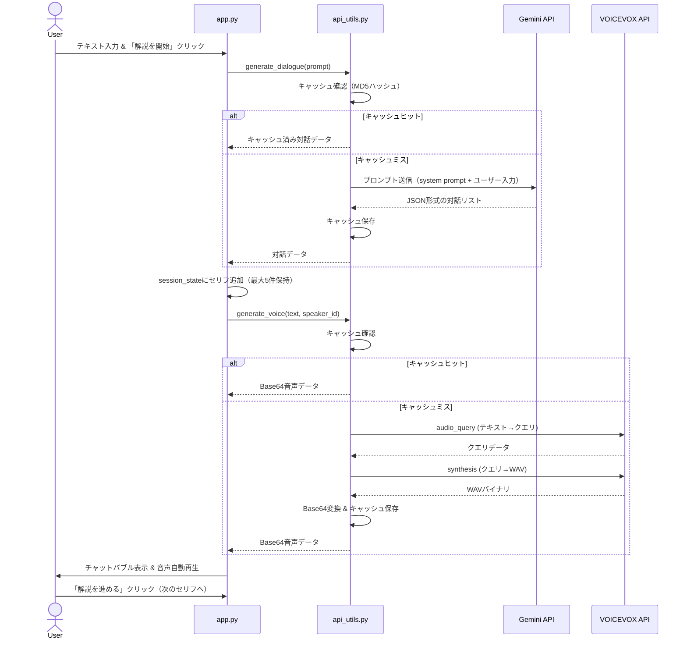

# 何かを解説するずんだもんなのだ 🎬

ずんだもんとあんこもんが対話形式でユーザーの質問を解説する、Streamlit ベースの Web アプリケーションです。  
Gemini API で台本（セリフ）を自動生成し、VOICEVOX API で音声合成を行うことで、YouTube 風の解説動画のような体験をブラウザ上で提供します。

---

## 基本設計

### アーキテクチャ概要

```
┌─────────────────────────────────────────────────────┐
│                  Streamlit UI (app.py)               │
│  ┌───────────┐  ┌──────────────┐  ┌───────────────┐ │
│  │ ずんだもん │  │ 対話エリア   │  │ あんこもん    │ │
│  │ 立ち絵     │  │ (チャット)   │  │ 立ち絵        │ │
│  └───────────┘  └──────┬───────┘  └───────────────┘ │
│                        │                             │
│  カスタムCSS (styles.py)                              │
└────────────────────────┼─────────────────────────────┘
                         │
              ┌──────────┴──────────┐
              │  api_utils.py       │
              │  (API連携 & キャッシュ)│
              └──┬──────────────┬───┘
                 │              │
     ┌───────────▼──┐   ┌──────▼───────┐
     │  Gemini API  │   │ VOICEVOX API │
     │  (台本生成)   │   │ (音声合成)   │
     └──────────────┘   └──────────────┘
```

### モジュール構成

| ファイル | 役割 |
|---|---|
| `app.py` | メインエントリポイント。Streamlit の UI レイアウト、セッション管理、ユーザー操作ハンドリング |
| `api_utils.py` | 外部 API 連携（Gemini / VOICEVOX）およびファイルベースキャッシュ |
| `styles.py` | カスタム CSS の定義（チャットバブル、キャラクター画像、ボタン等） |
| `assets/` | キャラクター立ち絵画像（`zundamon.png`, `ankomon.png`） |
| `.streamlit/secrets.toml` | API キーや接続先 URL 等の秘密情報（Git 管理対象外） |
| `pyproject.toml` | プロジェクトメタデータと依存パッケージ定義 |

---

## 処理フロー

### 対話生成〜音声再生の流れ



### ステップ実行の詳細

1. **初回クリック**: `generate_dialogue()` で全セリフを一括生成し `session_state.current_dialogue` に格納
2. **クリックごと**: `current_dialogue` から1件ずつ `messages` に追加（線形進行）
3. **表示制限**: `messages` は最大5件を保持し、古いものから削除（スクロール不要の UX）
4. **音声再生**: 追加されたセリフの話者ID（ずんだもん: 3, あんこもん: 113）に応じて音声生成・自動再生

---

## 外部 API 連携

### Gemini API（台本生成）

- **SDK**: `google-genai`（`genai.Client` 方式）
- **モデル**: `gemini-2.5-flash`
- **レスポンス形式**: `application/json`（構造化出力）
- **システムプロンプト**: キャラクター設定・出力フォーマット・構成指示を含む詳細なプロンプトを `SYSTEM_PROMPT` 定数で管理
- **出力仕様**: `[["left", "ずんだもんのセリフ"], ["right", "あんこもんのセリフ"], ...]` 形式の JSON リスト

### VOICEVOX API（音声合成）

- **プロトコル**: REST API（2ステップ方式）
  1. `POST /audio_query` — テキストから音声クエリを生成
  2. `POST /synthesis` — クエリから WAV 音声を合成
- **話者ID**: ずんだもん = `3`、あんこもん = `113`
- **タイムアウト**: `audio_query` 300秒、`synthesis` 600秒（外部ホスト想定の余裕あるタイムアウト）
- **デバッグ機能**: `DEBUG_SKIP_VOICE = true` で音声生成をスキップ可能

---

## キャッシュ戦略

同一リクエストの再処理を避け、API コスト・レイテンシを削減するためにファイルベースのキャッシュを採用しています。

| 対象 | キーの算出方法 | 保存形式 | 保存先 |
|---|---|---|---|
| 対話データ | `MD5(プロンプト文字列)` | JSON | `{cache_dir}/{hash}.json` |
| 音声データ | `MD5(テキスト_話者ID)` | Base64テキスト | `{cache_dir}/voice_{hash}.txt` |

- **保存先の決定ロジック**: `/tmp` が利用可能であれば `/tmp/zunda_cache/`、そうでなければプロジェクト直下の `tmp/zunda_cache/` を使用

---

## UI 設計

### レイアウト（3カラム構成）

```
┌──────────┬─────────────────────┬──────────┐
│ ずんだもん│   メインエリア       │ あんこもん│
│ (col1)   │   (col2)            │ (col3)   │
│ 立ち絵    │ ・テキスト入力欄     │ 立ち絵    │
│          │ ・アクションボタン    │          │
│          │ ・チャットバブル表示  │          │
│          │ ・音声再生           │          │
└──────────┴─────────────────────┴──────────┘
  比率: 1  :         2           :    1
```

- **キャラクター画像**: 対話開始前は非表示、開始後に表示（条件付きレンダリング）
- **`@st.fragment`**: メインインタラクションエリアを `st.fragment` でラップし、`st.rerun()` 時に全体再描画を回避

### スタイリング

- **フォント**: タイトルに「Dela Gothic One」（Google Fonts）、本文に「Inter」
- **配色**: ライトモード固定。ずんだもんのバブルはライトグリーン (`#f0fdf4`)、あんこもんのバブルはライトあずき色 (`#fcf1f1`)
- **アニメーション**: チャットバブルに `slideUp` アニメーション（0.4秒、cubic-bezier イージング）

---

## セッション管理

`st.session_state` で管理する状態:

| キー | 型 | 説明 |
|---|---|---|
| `messages` | `list[tuple[str, str]]` | 表示中のチャットメッセージ（最大5件） |
| `counter` | `int` | `current_dialogue` 内の現在位置 |
| `current_dialogue` | `list[list[str, str]]` | Gemini から取得した全セリフデータ |
| `last_prompt` | `str` | 前回のプロンプト（変更検知用） |
| `play_audio` | `bool` | 音声再生フラグ |
| `error_message` | `str` | `st.rerun()` 後もエラーを表示するためのバッファ |

---

## エラーハンドリング

- **`st.rerun()` 対策**: `@st.fragment` 内で `st.rerun()` が呼ばれると `st.error()` の表示がリセットされるため、エラーメッセージを `session_state.error_message` に保存し、再描画後に表示・クリアする方式を採用
- **API キー未設定**: ユーザーフレンドリーなフォールバックメッセージ（ずんだもんのセリフ形式）を返す
- **VOICEVOX エラー**: 音声生成に失敗した場合はサイレントフォールバック（空文字を返し、音声なしで続行）

---

## セットアップ

### 前提条件

- Python 3.10 以上
- [uv](https://docs.astral.sh/uv/) パッケージマネージャ（推奨）

### インストール

```bash
# 依存パッケージのインストール
uv sync
```

### 設定

`.streamlit/secrets.toml` を作成し、以下を設定:

```toml
GEMINI_API_KEY = "your-gemini-api-key"
VOICEVOX_ENGINE_URL = "https://your-voicevox-engine-url/"

# デバッグ時に音声生成をスキップする場合
# DEBUG_SKIP_VOICE = true
```

### 起動

```bash
uv run streamlit run app.py
```

---

## 依存パッケージ

| パッケージ | 用途 |
|---|---|
| `streamlit >= 1.35.0` | Web UI フレームワーク |
| `google-genai` | Gemini API クライアント（`genai.Client` 方式） |
| `requests` | VOICEVOX API への HTTP リクエスト |

---

## クレジット

- **VOICEVOX:ずんだもん** / **VOICEVOX:あんこもん**
- **キャラクター立ち絵**: 坂本アヒル様
